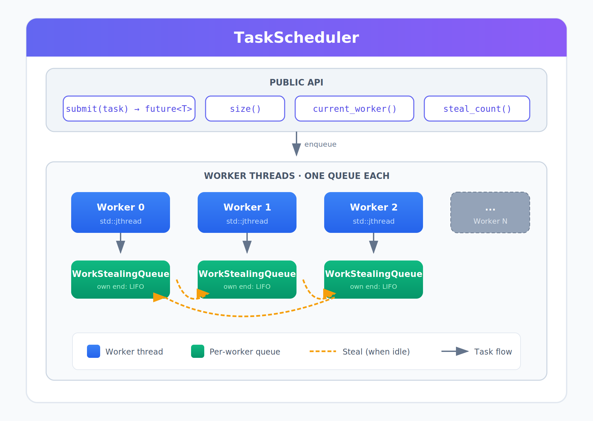
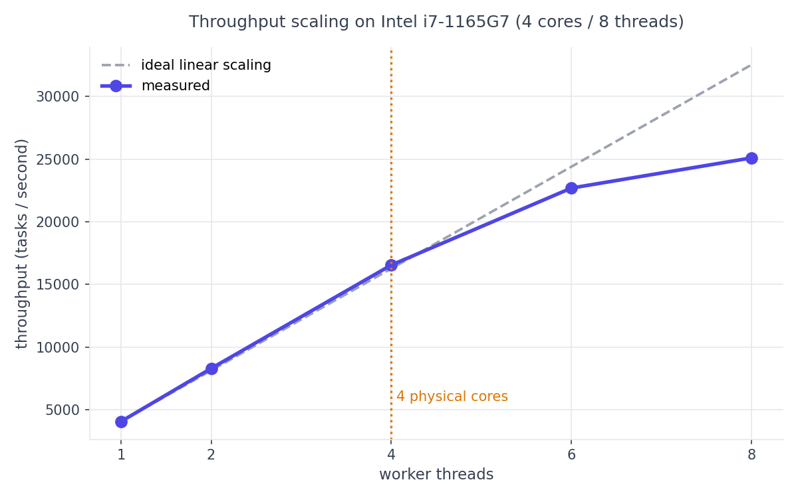
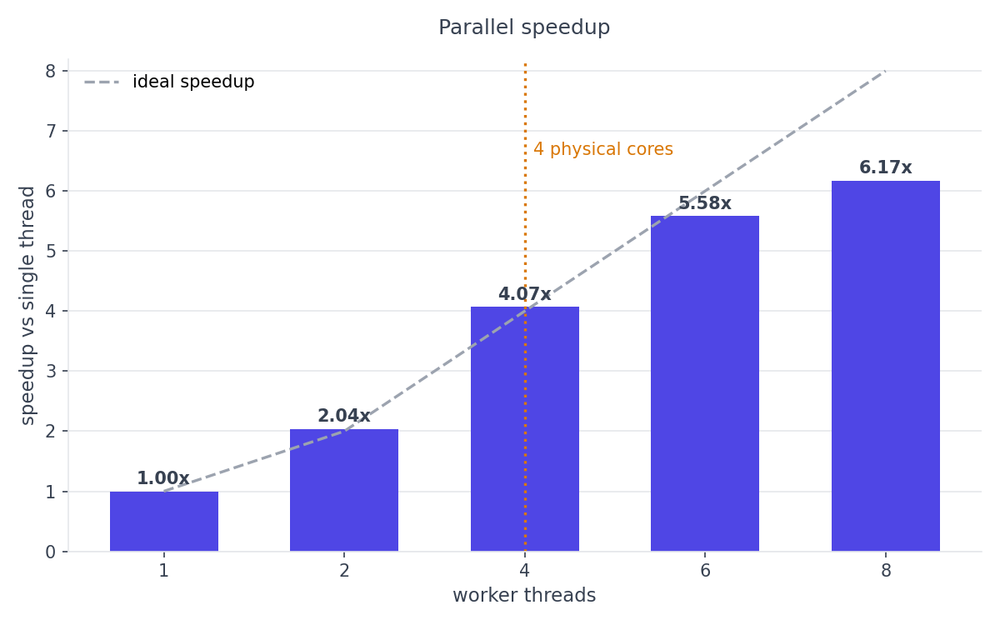

# cpp-work-stealing-scheduler

A high-performance, work-stealing task scheduler written in modern C++20.


Submit any callable, get a `std::future` back, and let a pool of worker threads
run tasks in parallel — each worker drawing from its own queue and stealing from
others when idle, so the cores stay busy and the queue never becomes a bottleneck.

## Architecture



The pool runs N worker threads, **each with its own task queue**. A worker takes
work from its own queue (LIFO, keeping recently-created work hot in cache) and,
when that queue runs dry, steals a task from another worker's queue (from the
opposite end, FIFO). Because each queue has its own lock, workers only contend
when they happen to touch the same queue — so the common case is contention-free,
which is what lets the pool scale.

## Features

- **Work-stealing scheduler** — per-worker queues with stealing for load balancing.
- **Futures** — `submit()` returns a `std::future<T>`; both results and exceptions
  propagate back to the caller.
- **Modern C++20** — `std::jthread`, `std::stop_token`, concepts, and cooperative
  cancellation throughout.
- **Graceful shutdown** — queued tasks are drained before workers exit; threads
  join automatically via RAII.
- **Observability** — `current_worker()` and `steal_count()` for introspection.
- **Tested** — unit tests run through CTest and the scheduler is verified
  race-free with ThreadSanitizer.

## Quick start

Requires a C++20 compiler (GCC 11+ / Clang 14+) and CMake 3.20+.

```bash
cmake -S . -B build
cmake --build build
```

Run the demo (squares computed in parallel):

```bash
./build/demo
```

Watch work-stealing happen live, colour-coded per worker:

```bash
./build/visual_demo
```

Run the tests:

```bash
ctest --test-dir build --output-on-failure
```

## Usage

```cpp
#include "task_scheduler/task_scheduler.hpp"

ts::TaskScheduler pool(4);

auto future = pool.submit([] { return 6 * 7; });
int result = future.get();   // 42
```

`submit` accepts any callable and returns a `std::future` of its result type.
If a task throws, the exception is re-thrown when you call `.get()`.

## Benchmarks

Measured on an Intel Core i7-1165G7 (4 physical cores / 8 threads), Linux,
Release build (`-O2`). Workload: 4000 CPU-bound tasks.





| workers | tasks/sec | speedup |
| ------: | --------: | ------: |
| 1       | 4067      | 1.00x   |
| 2       | 8299      | 2.04x   |
| 4       | 16548     | 4.07x   |
| 6       | 22695     | 5.58x   |
| 8       | 25101     | 6.17x   |

Throughput scales near-linearly up to 4 workers — matching the 4 physical
cores — then keeps gaining through 8 threads as hyper-threading fills the
latency gaps in the (deliberately dependent) benchmark workload.

To reproduce — benchmarks must be built in Release mode, since an unoptimised
build reports meaningless numbers:

```bash
cmake -S . -B cmake-build-release -DCMAKE_BUILD_TYPE=Release
cmake --build cmake-build-release --target benchmark
./cmake-build-release/benchmark
```

## Design notes

- **Work-stealing, not lock-free.** Each queue is guarded by its own mutex.
  Work-stealing (the scheduling strategy) and lock-free (the synchronisation
  mechanism) are independent concerns; per-queue locking captures most of the
  contention benefit with code that is straightforward to reason about and
  verify. A lock-free deque (e.g. Chase–Lev) would be a natural next step.
- **Blocking inside tasks.** Like any fixed-size pool, blocking inside a task
  while waiting on other tasks from the same pool can deadlock if every worker
  blocks at once. Submit independent work, or collect results from outside the
  pool.
- **Shutdown drains.** The destructor lets workers finish all queued tasks
  before exiting, rather than discarding pending work.

## Project layout

```
include/task_scheduler/   public headers (scheduler + work-stealing queue)
src/                      implementation, demo, visual demo
tests/                    unit tests (CTest)
benchmarks/               throughput benchmark
docs/                     architecture diagram, benchmark charts, results
```

## License

MIT — see [LICENSE](LICENSE).
